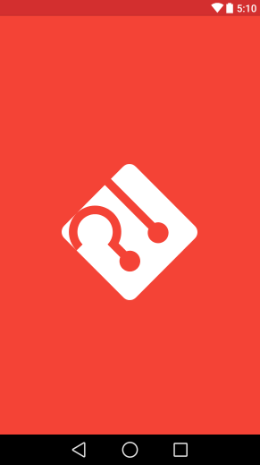
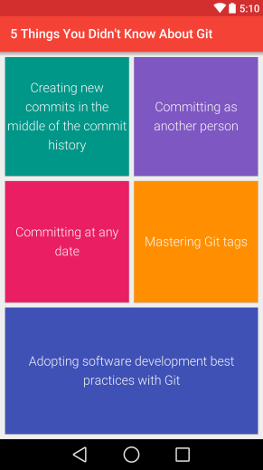
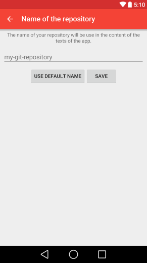
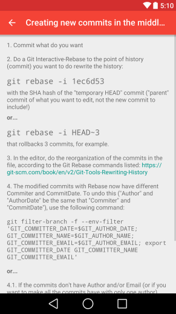
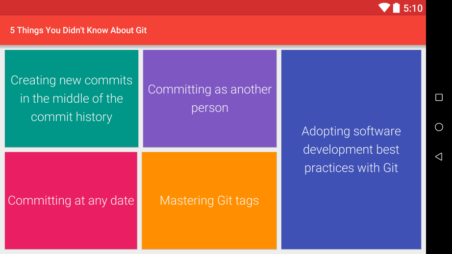

<h1>5 Things You Didn't Know About Git</h1>

Screenshots
-----------
|  |  |
|----|----|
|  |  |

|  |
|----|

**5 Things You Didn't Know About Git** ("*5 coisas que você não sabia sobre o Git*") é um aplicativo que reunirá 5 dicas (na forma de tutoriais) de operações úteis (**e perigosas**) de uso do sistema de controle de versão mais usado no mundo *open source*, [**Git**](https://git-scm.com).

As 5 "coisas":

* **Novos commits no meio do histórico de commits**
	- Ensinará a fazer [git rebase interativo](https://git-scm.com/book/en/v2/Git-Tools-Rewriting-History) com [filtragem de commits](https://git-scm.com/docs/git-filter-branch) para não deixar rastros de modificação de commits no repositório.
* "***Commitando***" **como outra pessoa**
	- Ensinará a criar commits com assinatura de outro autor sem ser o configurado no [Git config](https://git-scm.com/book/en/v2/Customizing-Git-Git-Configuration), sem modificar tal configuração.
* "***Commitando***" **em qualquer data**
	- Ensinará a criar commits em horário diferente do atual, podendo ser uma data passada ou futura.
* **Masterizando Git** ***tags***
	- Ensinará a criar e modificar tags de forma efetiva e uniforme.
* **Adotando *boas práticas* de desenvolvimento de software com Git**
	- Apresentará um pequeno guia de boas práticas de controle de versão.
